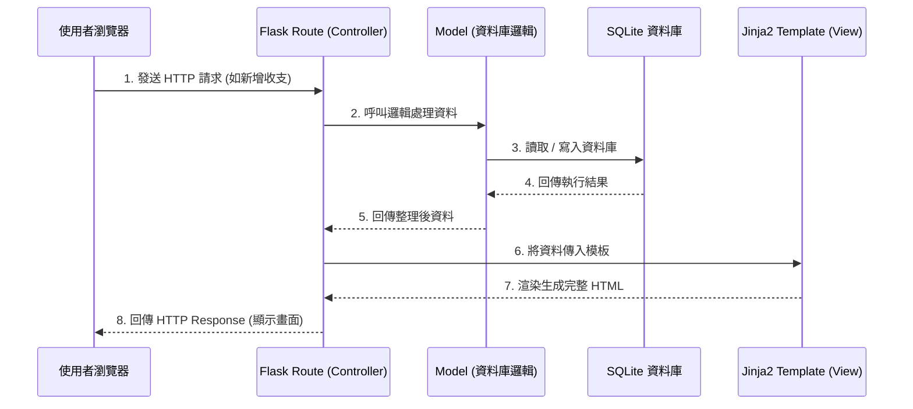

# 系統架構文件 - 個人記帳簿

這份文件基於 [產品需求文件 (PRD)](PRD.md)，描述「個人記帳簿」系統的技術架構設計、資料夾結構以及各元件間的關聯。

## 1. 技術架構說明

本專案採用的技術組合為 **Flask + Jinja2 + SQLite**，並使用傳統的 MVC（Model-View-Controller）設計模式來架構，不採用前後端分離。

### 選用技術與原因
- **後端：Python + Flask**
  Flask 是一個輕量級的 Web 框架，適合快速開發和建立簡單且功能明確的應用。對於個人記帳簿這類功能集中的應用程式，Flask 足以提供高效的路由與控制邏輯，且學習曲線平緩，便於團隊快速上手。
- **模板引擎：Jinja2**
  做為 Flask 內建的模板引擎，它能無縫地將後端的資料傳遞到前端 HTML，動態生成網頁內容，不須另外配置龐大的前端框架。
- **資料庫：SQLite**
  因為是個人的收支紀錄系統，資料量相對較小且不需複雜的伺服器級資料庫管理系統。SQLite 以單一檔案形式儲存，部署容易、輕量且足夠支援所需的關聯性資料儲存與查詢。

### Flask MVC 模式說明
- **Model (模型)**：負責定義資料結構（如：收支紀錄、預算、帳戶等）以及處理與資料庫 (SQLite) 的互動。
- **View (視圖)**：負責呈現使用者介面。在這個架構中，View 由包含 HTML 結構的 Jinja2 模板擔任，並加上 CSS/JS 輔助前端互動與樣式。
- **Controller (控制器)**：在 Flask 中，Controller 的角色由 `routes` (路由函式) 扮演。它負責接收瀏覽器傳來的請求，呼叫 Model 取得或修改資料，接著將處理結果交給 View (Jinja2 模板) 去渲染最終頁面回傳給使用者。

---

## 2. 專案資料夾結構

為了讓程式碼好維護、好擴充，我們將專案拆分成以下資料夾結構：

```text
web_app_development2/
├── app/                  # 應用程式主要資料夾
│   ├── models/           # (Model) 資料庫模型定義，處理資料邏輯
│   │   ├── __init__.py
│   │   ├── record.py     # 收支紀錄模型
│   │   ├── account.py    # 帳戶模型
│   │   └── budget.py     # 預算模型
│   ├── routes/           # (Controller) 路由定義，處理 HTTP 請求
│   │   ├── __init__.py
│   │   ├── index.py      # 首頁及儀表板 (報表分析)
│   │   ├── record.py     # 處理收支新增、編輯、刪除
│   │   ├── account.py    # 處理帳戶管理
│   │   └── budget.py     # 處理預算設定
│   ├── templates/        # (View) Jinja2 HTML 模板
│   │   ├── base.html     # 共用版型 (包含導覽列等)
│   │   ├── index.html    # 首頁儀表板
│   │   ├── record.html   # 收支表單與列表
│   │   └── ...
│   └── static/           # 靜態資源 (前端相關)
│       ├── css/          # 樣式表
│       ├── js/           # 前端互動腳本 (例如：圖表渲染)
│       └── images/       # 圖片資源
├── instance/             # 存放本地端或敏感檔案 (不會進入版控)
│   └── database.db       # SQLite 資料庫檔案
├── docs/                 # 系統文件
│   ├── PRD.md            # 需求文件
│   └── ARCHITECTURE.md   # 架構文件 (本文件)
├── app.py                # 系統入口點，用來啟動 Flask 伺服器
└── requirements.txt      # Python 依賴套件清單
```

---

## 3. 元件關係圖

以下展示使用者如何透過瀏覽器與系統互動的資料流向：



---

## 4. 關鍵設計決策

1. **採用伺服器端渲染 (Server-Side Rendering)**
   **決策**：前端畫面由 Jinja2 結合 Flask 在伺服器端渲染生成，不使用 React/Vue 等框架。
   **原因**：可大幅降低系統複雜度，專注於收支核心邏輯。對於個人記帳簿的簡單表單操作而言，這樣的效能與體驗已經非常足夠。

2. **模組化路由設計 (Blueprints)**
   **決策**：將路由分門別類拆分到 `routes/` 資料夾下，並使用 Flask Blueprint。
   **原因**：避免所有邏輯全塞在 `app.py` 中。未來若要增加新功能（例如進階報表、多幣別支援），可以方便地建立新的 route 模組，提升擴充性。

3. **統一版型設計 (Template Inheritance)**
   **決策**：在 `templates/` 中建立 `base.html`，所有頁面皆繼承此版型。
   **原因**：確保網站的導覽列 (Navbar) 與整體設計風格一致，同時避免重複撰寫相同的 HTML `<head>` 內容。

4. **圖表渲染放前端 (Chart.js / ECharts)**
   **決策**：後端只負責計算支出比例並拋出 JSON 或在模板中帶入變數，由前端 JavaScript 繪製圓餅圖與柱狀圖。
   **原因**：減輕後端繪圖壓力，前端繪製的圖表也具有更好的互動性（如：Hover 顯示詳細數字），能帶給使用者更佳的體驗。
