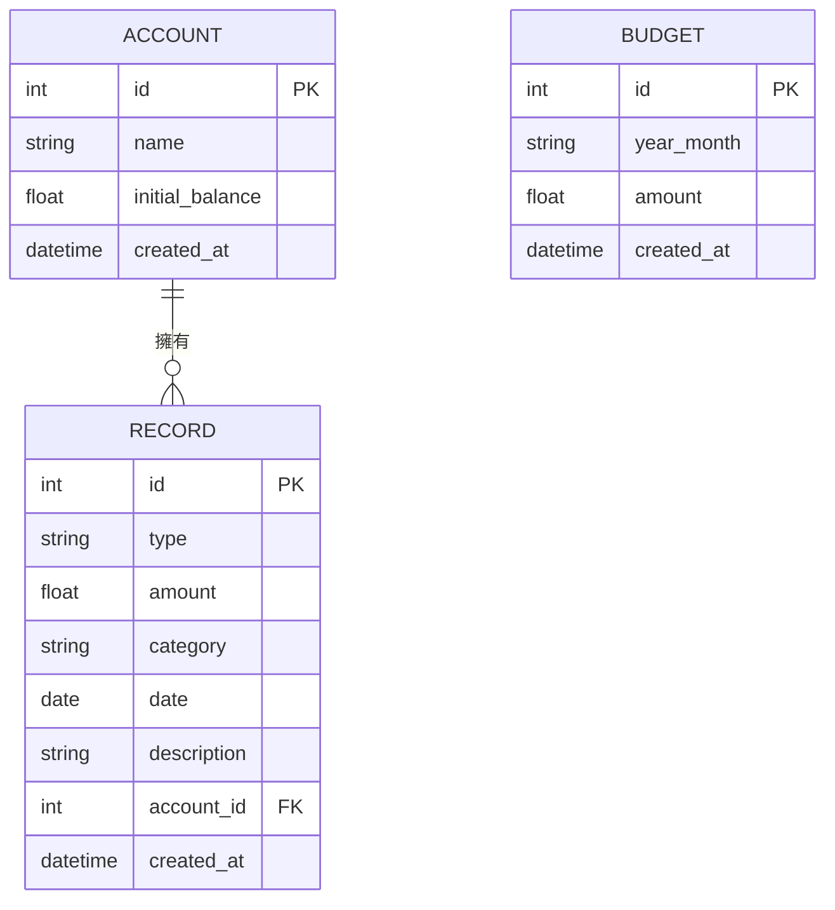

# DB Design - 資料庫設計文件

這份文件基於 PRD、系統架構與流程圖，定義了個人記帳簿系統的資料庫設計。我們採用 SQLite 作為資料庫。

## 1. ER 圖（實體關係圖）

## 2. 資料表詳細說明

### 2.1 ACCOUNT (帳戶資料表)
儲存使用者的資金來源帳戶（例如：現金、信用卡、銀行存款）。
- `id` (INTEGER): 主鍵，自動遞增。
- `name` (TEXT): 帳戶名稱，必填。
- `initial_balance` (REAL): 初始餘額，預設為 0。
- `created_at` (DATETIME): 建立時間，自動產生。

### 2.2 RECORD (收支紀錄表)
儲存每一筆收入或支出紀錄。
- `id` (INTEGER): 主鍵，自動遞增。
- `type` (TEXT): 類型，'income' (收入) 或 'expense' (支出)，必填。
- `amount` (REAL): 金額，必填。
- `category` (TEXT): 分類（如：食、衣、住、行），必填。
- `date` (DATE): 紀錄日期 (YYYY-MM-DD)，必填。
- `description` (TEXT): 備註/說明，選填。
- `account_id` (INTEGER): 關聯的帳戶 ID，外鍵。
- `created_at` (DATETIME): 建立時間，自動產生。

### 2.3 BUDGET (預算資料表)
儲存每個月的預算設定。
- `id` (INTEGER): 主鍵，自動遞增。
- `year_month` (TEXT): 預算月份 (格式 YYYY-MM)，必填，應為唯一。
- `amount` (REAL): 預算總額，必填。
- `created_at` (DATETIME): 建立時間，自動產生。

## 3. SQL 建表語法
請參考 `database/schema.sql` 檔案。

## 4. Python Model 程式碼
請參考 `app/models/` 目錄下的 Python 檔案，包含 CRUD 操作。
- `app/models/account.py`
- `app/models/record.py`
- `app/models/budget.py`
