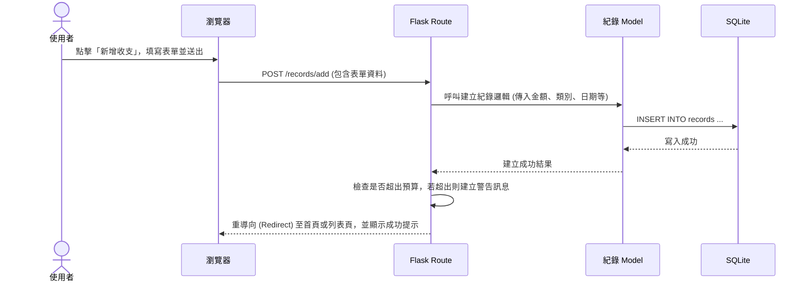

# 流程圖與功能對照表 - 個人記帳簿

這份文件基於 PRD 與系統架構文件，視覺化使用者的操作路徑與系統資料流，並列出主要功能的 URL 與 HTTP 方法對照表。

## 1. 使用者流程圖（User Flow）

此流程圖描述使用者進入網站後，可以進行的各項主要操作路徑。

```mermaid
flowchart LR
    A([使用者開啟網頁]) --> B[首頁 / 儀表板 (圖表分析)]
    B --> C{選擇功能}
    
    C -->|新增紀錄| D[填寫收支表單]
    D --> D1[儲存並返回首頁]
    
    C -->|查看歷史紀錄| E[歷史紀錄列表]
    E --> E1[搜尋 / 篩選紀錄]
    E --> E2[編輯 / 刪除紀錄]
    E --> E3[匯出 CSV]
    
    C -->|管理帳戶| F[帳戶管理介面]
    F --> F1[新增 / 編輯帳戶]
    
    C -->|設定預算| G[預算設定介面]
    G --> G1[設定每月預算與提醒]
```

## 2. 系統序列圖（Sequence Diagram）

此序列圖以「使用者新增收支紀錄」為例，描述從使用者操作到資料庫存取的完整系統流向。



## 3. 功能清單對照表

以下為系統中各主要功能、對應的 URL 路徑與 HTTP 方法的規劃：

| 功能名稱 | URL 路徑 | HTTP 方法 | 說明 |
| --- | --- | --- | --- |
| 首頁 / 儀表板 | `/` | GET | 顯示當月報表、圓餅圖與近期紀錄 |
| 歷史紀錄列表 | `/records` | GET | 顯示歷史紀錄，支援查詢與篩選 |
| 新增收支頁面 | `/records/add` | GET | 顯示新增收支的表單 |
| 送出新增收支 | `/records/add` | POST | 處理新增收支的表單資料並儲存 |
| 編輯收支頁面 | `/records/<id>/edit` | GET | 顯示編輯特定收支的表單 |
| 送出修改收支 | `/records/<id>/edit` | POST | 處理特定收支的修改並更新資料庫 |
| 刪除收支 | `/records/<id>/delete`| POST | 刪除特定的收支紀錄 |
| 匯出 CSV | `/records/export` | GET | 將篩選後的紀錄匯出為 CSV 檔案下載 |
| 帳戶管理列表 | `/accounts` | GET | 顯示所有帳戶 (現金、信用卡等) 餘額 |
| 新增/編輯帳戶 | `/accounts/add` (等) | GET, POST | 顯示並處理帳戶的新增與編輯 |
| 預算設定頁面 | `/budgets` | GET | 顯示目前預算設定與花費進度 |
| 送出預算設定 | `/budgets` | POST | 儲存新的預算設定值 |

